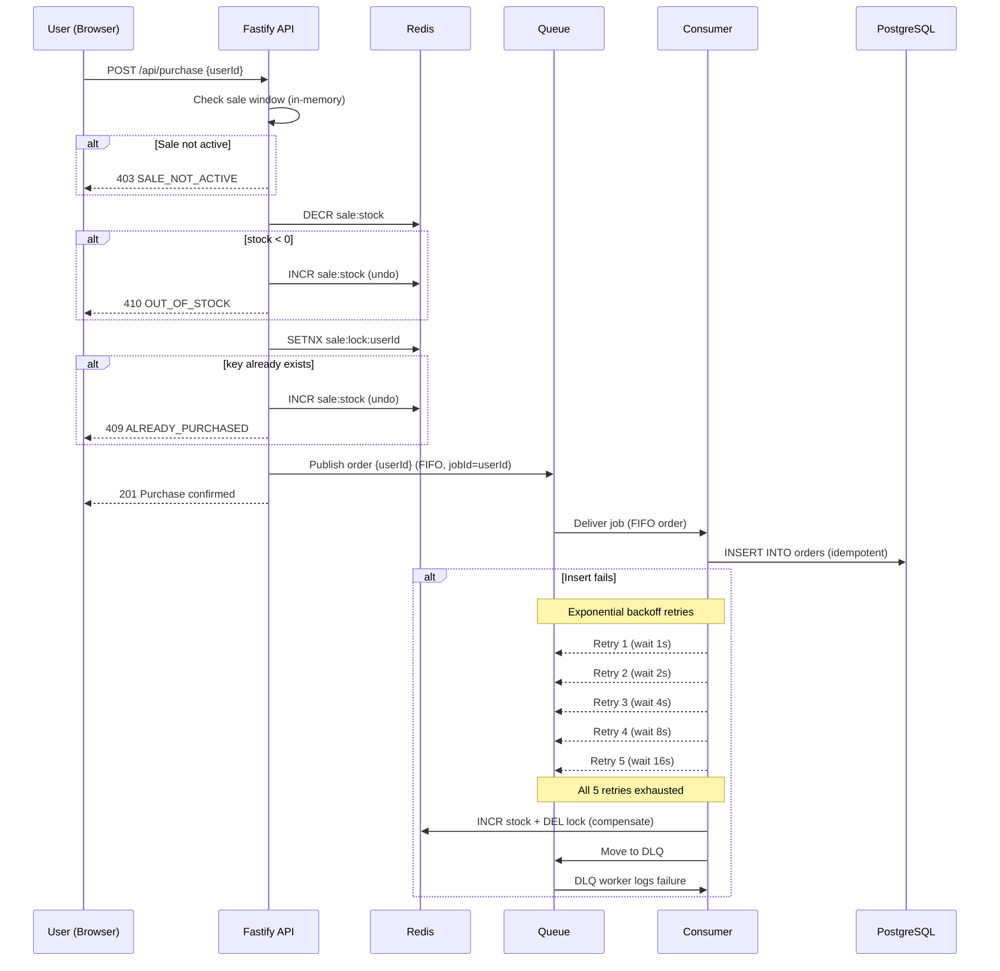
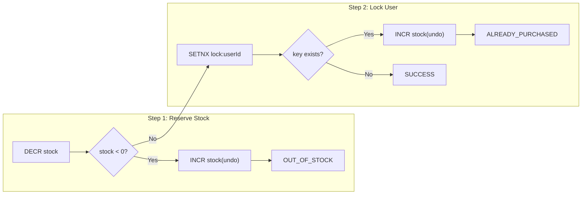

# Flash Sale System

A high-throughput flash sale backend built with Fastify, Redis, and React. Handles thousands of concurrent purchase attempts with zero overselling.

## Architecture


### Purchase Flow



### Concurrency Control Detail



DECR and INCR are atomic Redis operations. SETNX is atomic and returns 0 if the key already exists, providing built-in duplicate detection.

## Design Choices & Trade-offs

### Why Fastify?

Fastify handles ~30k req/s vs Express ~10k req/s. For a "high throughput" requirement, this is suitable.

### Why ElastiCache?

Redis (ElastiCache) as the stock reservation layer. All purchase attempts hit a single counter — Redis's single-threaded, in-memory model is ideal for this.

**Why Redis works here:**

- **<1ms latency**: In-memory, single-threaded command execution.
- **Atomic without locks**: `DECR`, `INCR`, `SET NX` are individually atomic. No distributed locks or conditional expressions needed.
- **No hot-partition limit**: Single-threaded serialization handles any throughput on one key.

**Alternative option: DynamoDB**

Stock reservation via `UpdateItem` with `ConditionExpression` (`SET stock = stock - 1` where `stock > 0`):

- **Hot partition**: Single item = single partition. Hits ~1,000 WCU limit under burst traffic.
- **Higher latency**: 1-10ms vs Redis <1ms. Compounds at 1,000+ concurrent requests.
- **Retry overhead**: Conditional write failures need client-side retries with backoff.
- **Advantage**: Durable by default. Acceptable trade-off here since PostgreSQL is the source of truth; Redis is only the reservation gate.

**Trade-off:**


| Aspect                       | Redis (ElastiCache)          | DynamoDB                          |
| ---------------------------- | ---------------------------- | --------------------------------- |
| Latency                      | <1ms                         | 1-10ms                            |
| Throughput on single counter | 100K+ ops/s                  | ~1K WCU per partition             |
| Atomicity model              | Built-in atomic commands     | Conditional expressions + retries |
| Durability                   | Volatile (replication only)  | Fully durable                     |
| Operational overhead         | Requires ElastiCache cluster | Serverless                        |
| Failure mode                 | Data loss on failover        | Throttling on hot keys            |


Redis handles the hot path. PostgreSQL is the durable source of truth via the async queue.

### Queue → Consumer → DB (SQS Pattern)

After Redis confirms a purchase, an order job is published to a FIFO queue grouped by userId.

- **FIFO ordering**: Jobs process in enqueue order
- **Grouped by userId**: `jobId = userId` gives per-user deduplication and sequential retries

**Retry Mechanism (Exponential Backoff):**

```
Attempt 1 → fail → wait 1s
Attempt 2 → fail → wait 2s
Attempt 3 → fail → wait 4s
Attempt 4 → fail → wait 8s
Attempt 5 → fail → wait 16s → EXHAUSTED → move to DLQ
```

Exponential backoff: base 1s, multiplier 2x. After 5 failures, job moves to DLQ.

**Dead Letter Queue (DLQ):**

- Compensation (`INCR sale:stock` + `DEL sale:lock:userId`) runs before the job is pushed to DLQ
- DLQ worker logs failure history for debugging and monitoring

**Why SQS FIFO over RabbitMQ?**

- SQS is serverless - no brokers to provision, patch, or scale. RabbitMQ (via Amazon MQ) requires managing broker instances, storage, and cluster topology.
- **FIFO + message grouping**: `MessageGroupId = userId` gives per-user ordering and deduplication natively. RabbitMQ needs plugin setup or custom consumer logic.
- **Dead letter queues**: SQS DLQ is a config toggle. RabbitMQ DLQ requires exchange/queue binding configuration.
- **Cost**: SQS charges per request with no idle cost. Amazon MQ charges per broker-hour regardless of traffic which wasteful for a flash sale that runs for minutes.

**Trade-off**: SQS has higher per-message latency. Acceptable here since queue processing is async and not in the user's request path.

**Why BullMQ locally?**

BullMQ reuses the existing Redis container - no additional services needed. Retries, DLQ, and job deduplication (`jobId = userId`) work out of the box.

**Production mapping:**


| Local      | Production  |
| ---------- | ----------- |
| Redis      | ElastiCache |
| BullMQ     | SQS FIFO    |
| PostgreSQL | RDS         |
| BullMQ DLQ | SQS DLQ     |


### Extra suggestions:

- **use reCaptcha**: to prevent bots
- **Monitoring**: CloudWatch metrics + X-Ray distributed tracing.
- **Feature Flag:** for safer rollout and rollback

## Prerequisites

- Node.js 18+
- Docker & Docker Compose

## Quick Start

```bash
# 1. Start Redis + PostgreSQL
docker compose up -d

# 2. Install dependencies
npm install

# 3. Start backend (port 3000) - includes queue consumer
npm run dev:backend

# 4. Start frontend (port 5173) - in another terminal
npm run dev:frontend

# 5. Open http://localhost:5173
```

### Configuration

Environment variables for the backend:


| Variable           | Default      | Description           |
| ------------------ | ------------ | --------------------- |
| `SALE_START_TIME`  | now + 1 min  | Sale start (epoch ms) |
| `SALE_END_TIME`    | now + 61 min | Sale end (epoch ms)   |
| `SALE_TOTAL_STOCK` | 100          | Total items available |
| `REDIS_HOST`       | localhost    | Redis host            |
| `REDIS_PORT`       | 6379         | Redis port            |
| `DB_HOST`          | localhost    | PostgreSQL host       |
| `DB_PORT`          | 5432         | PostgreSQL port       |
| `DB_NAME`          | flashsale    | Database name         |
| `DB_USER`          | flashsale    | Database user         |
| `DB_PASSWORD`      | flashsale    | Database password     |
| `PORT`             | 3000         | API server port       |


See `.env.example` for a complete template.

To start a sale immediately with 50 items:

```bash
SALE_START_TIME=$(date +%s000) SALE_END_TIME=$(($(date +%s000) + 3600000)) SALE_TOTAL_STOCK=50 npm run dev:backend
```

## API Endpoints


| Method | Path                    | Description                   | Responses                     |
| ------ | ----------------------- | ----------------------------- | ----------------------------- |
| `GET`  | `/api/sale/status`      | Sale status + remaining stock | `200`                         |
| `POST` | `/api/purchase`         | Attempt purchase `{userId}`   | `201` / `403` / `409` / `410` |
| `GET`  | `/api/purchase/:userId` | Check user's purchase status  | `200`                         |
| `GET`  | `/health`               | Server + Redis + DB health    | `200`                         |


## Running Tests

```bash
# Unit tests (no Redis/DB needed)
npm test

# Integration tests (requires docker compose up -d)
npm test

# Stress test (requires docker compose up -d)
npm run test:stress
```

### Unit Tests (12 tests)

Test sale status logic, purchase service (DECR/INCR/SETNX flow), and compensation logic with mocked Redis.

### Integration Tests (12 tests)

Full API tests against real Redis: purchase success, duplicate rejection, stock depletion, sale window enforcement, input validation.

### Stress Test Results

**Phase 1: 1000 concurrent purchase attempts, 100 stock**

```
Successes:          100
Out of Stock:       900
Already Purchased:  0
Errors:             0

Total time:         71ms
Throughput:         14,076 req/s
Latency p50:        55.3ms
Latency p95:        65.7ms
Latency p99:        66.0ms
```

**Phase 2: 1000 duplicate purchase attempts (all users retry)**

```
Out of Stock:       1000  (stock=0, DECR check fires before SETNX)
New Successes:      0
Errors:             0
Time:               44ms
```

**Expected outcome:**

- Exactly 100 successful purchases (matching stock)
- Zero overselling
- Zero errors
- Redis state is consistent (stock = 0, purchase set = 100)
- No new purchases possible after stock depleted

## Project Structure

```
sale-system/
├── docker-compose.yml          # Redis + PostgreSQL
├── db/
│   └── init.sql                # Orders table schema
├── package.json                # npm workspaces root
├── backend/
│   ├── src/
│   │   ├── app.ts              # Fastify app builder
│   │   ├── index.ts            # Server entry + worker startup
│   │   ├── config.ts           # Environment config
│   │   ├── routes/             # API route handlers
│   │   ├── services/           # Business logic (DECR/INCR)
│   │   ├── redis/              # Redis client + key constants
│   │   ├── db/                 # PostgreSQL client + queries
│   │   ├── queue/              # BullMQ queue + consumer + DLQ
│   │   └── types/              # TypeScript types
│   └── tests/
│       ├── unit/               # Mocked service tests
│       ├── integration/        # Real Redis API tests
│       └── stress/             # Concurrent load test
├── frontend/
│   └── src/
│       ├── App.tsx             # Main app
│       ├── components/         # UI components
│       └── hooks/              # API hooks
└── imgs/
    ├── flash-sale-system.svg   # System diagram
    ├── purchase-flow-sequence.png
    └── concurrency-flow.png
```

