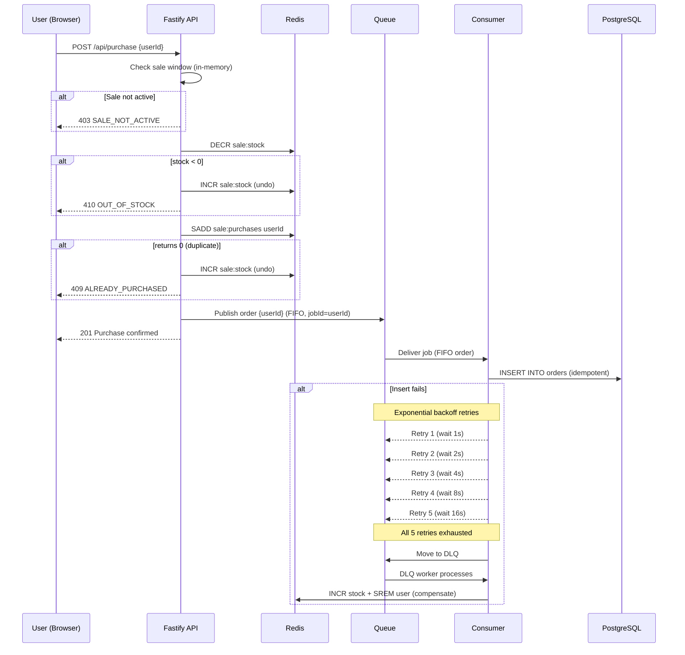
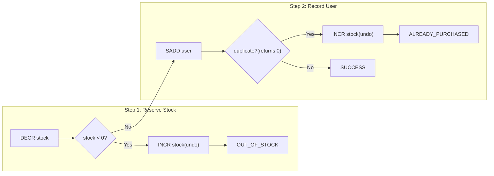

# System Architecture

## Purchase Flow

See [purchase-flow-sequence.png](./purchase-flow-sequence.png) for the rendered diagram.

## Concurrency Control Detail

See [concurrency-flow.png](./concurrency-flow.png) for the rendered diagram.

DECR and INCR are atomic Redis operations. SADD is also atomic and returns 0 if the member already exists, providing built-in duplicate detection.

## System Diagram

See [flash-sale-system.svg](./flash-sale-system.svg) for the full system diagram.

